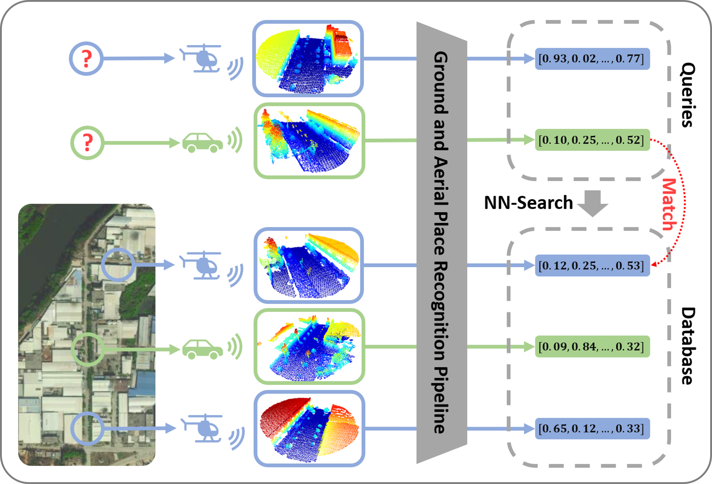

# GAPR

## Heterogeneous Deep Metric Learning for Ground and Aerial Point Cloud-Based Place Recognition

## Introduction
In this paper, we propose a heterogeneous deep metric learning pipeline for ground and aerial point cloud-based place recognition in large-scale environments.The pipeline extracts local features from ground and aerial raw point clouds by a sparse convolution module. The local features are processed by transformer encoders to capture the overlaps between ground and aerial point clouds, and then transformed to unified descriptors for retrieval purposes by backpropagation of heterogeneous loss functions.To facilitate training and provide a reliable benchmark, a large-scale dataset is also proposed, which is collected from well-equipped ground and aerial robotic platforms. We demonstrate the superiority of the proposed method by comparing it with existing well-performed methods. We also show that our method is capable to detect loop closures in a collaborative ground and aerial robotic system in the experimental results.

    

        
    

    An illustration of the ground and aerial point cloud-based place recognition task. The place recognition pipeline transforms point clouds from ground and aerial views into unified descriptors. The place retrieval is to search the database for the descriptors that match the queries.

## Contributors
[Yingrui Jie 揭英睿](https://github.com/jieyr3Rui), [Yilin Zhu 朱奕霖](https://github.com/inntoy), and
[Hui Cheng 成慧](https://cse.sysu.edu.cn/content/2504) from [SYSU RAPID Lab](http://lab.sysu-robotics.com/).

## Codes & Datasets
Our paper is currently under review, and our code and dataset will be released once the paper is accepted.