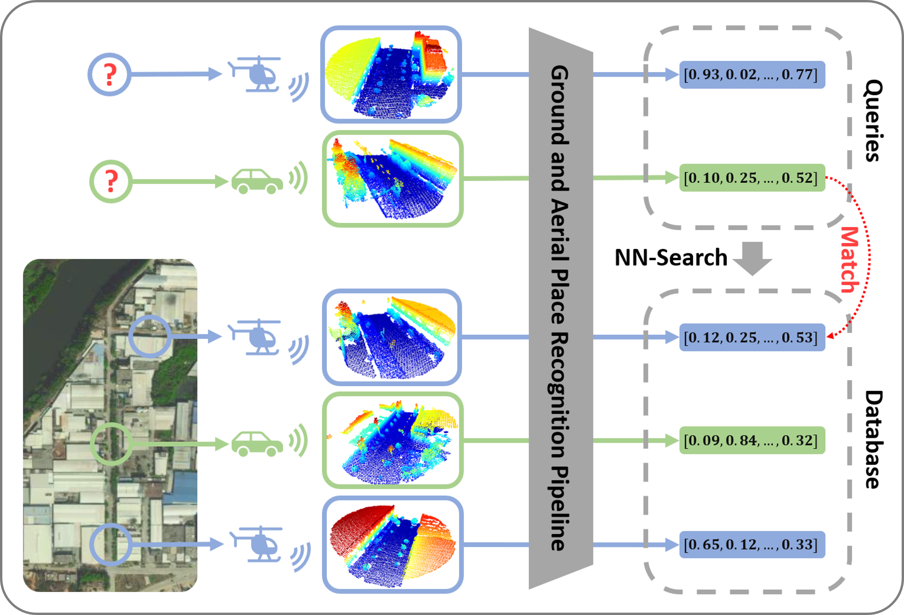
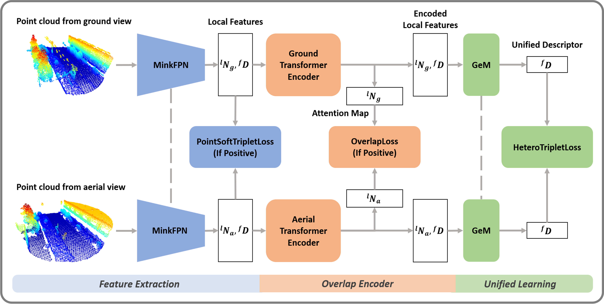

# GAPR

## Introduction
[RA-L 23] Heterogeneous Deep Metric Learning for Ground and Aerial Point Cloud-Based Place Recognition

In this paper, we propose a heterogeneous deep metric learning pipeline for ground and aerial point cloud-based place recognition in large-scale environments.The pipeline extracts local features from ground and aerial raw point clouds by a sparse convolution module. The local features are processed by transformer encoders to capture the overlaps between ground and aerial point clouds, and then transformed to unified descriptors for retrieval purposes by backpropagation of heterogeneous loss functions.To facilitate training and provide a reliable benchmark, a large-scale dataset is also proposed, which is collected from well-equipped ground and aerial robotic platforms. We demonstrate the superiority of the proposed method by comparing it with existing well-performed methods. We also show that our method is capable to detect loop closures in a collaborative ground and aerial robotic system in the experimental results.

<div align="center">
    <div align="center">
        
    </div>
    <font>
    Task Illustration</font>
</div>

<div align="center">
    <div align="center">
        
    </div>
    <font>
    GAPR Pipeline</font>
</div>


## Contributors
[Yingrui Jie 揭英睿](https://github.com/yingruijie), 
[Yilin Zhu 朱奕霖](https://github.com/inntoy), and
[Hui Cheng 成慧](https://cse.sysu.edu.cn/content/2504) from 
[SYSU RAPID Lab](http://lab.sysu-robotics.com).

## Citation
```tex
@ARTICLE{10173571,
  author={Jie, Yingrui and Zhu, Yilin and Cheng, Hui},
  journal={IEEE Robotics and Automation Letters}, 
  title={Heterogeneous Deep Metric Learning for Ground and Aerial Point Cloud-Based Place Recognition}, 
  year={2023},
  volume={},
  number={},
  pages={1-8},
  doi={10.1109/LRA.2023.3292623}}
```


# Usage
## Environment
This project has been tested on a system with Ubuntu 18.04. Main dependencies include: CUDA >= 10.2; PyTorch >= 1.9.1; MinkowskiEngine >= 0.5.4; Opne3D >= 0.15.2. Please set up the requirments as follows.
1. Install [cuda-10.2](https://developer.nvidia.com/cuda-10.2-download-archive). 

2. Create the anaconda environment.
```sh
conda create -n gapr python=3.8
conda activate gapr
```
3. [PyTorch](https://pytorch.org/).
```sh
pip install torch==1.9.1+cu102 torchvision==0.10.1+cu102 torchaudio==0.9.1 -f https://download.pytorch.org/whl/torch_stable.html
```

4. [MinkowskiEngine](https://github.com/NVIDIA/MinkowskiEngine).
```sh
conda install openblas-devel -c anaconda
git clone https://github.com/NVIDIA/MinkowskiEngine.git
cd MinkowskiEngine
export CXX=g++-7
git checkout v0.5.4 
python setup.py install --blas_include_dirs=${CONDA_PREFIX}/include --blas=openblas
cd ..
```

5. Install requirements.
```sh
# install setuptools firstly to avoid some bugs
pip install setuptools==58.0.4
pip install tqdm open3d tensorboard pandas matplotlib pillow ptflops timm==0.9.2
```

6. Download this repository.
```sh
git clone https://github.com/SYSU-RoboticsLab/GAPR.git
cd GAPR
```
Add the python path before running codes:
```sh
export PYTHONPATH=$PYTHONPATH:/PATH_TO_CODE/GAPR
```

## Dataset
Please download our [benchmark dataset](https://pan.baidu.com/s/1TsxSNZVkGwpZjBM0eNXglw?pwd=zxx4) and unpack the tar file.
Run the following command to check the dataset (`train` and `evaluate`).
```sh
python datasets/lprdataset.py --dataset /PATH_TO_DATASET/benchmark/train
python datasets/lprdataset.py --dataset /PATH_TO_DATASET/benchmark/evaluate
```

## Evaluate
1. Change the path of dataset in `config/evaluate/once.yaml`.
```yaml
# ...
dataloaders: 
  evaluate:
    dataset: /PATH_TO_DATASET/benchmark/evaluate
# ...
```
2. We provide a pretrain weights for evaluation.
```sh
python evaluate/once.py --weights pretrain/GAPR.pth --yaml config/evaluate/once.yaml
```
Parameter `weights` is used to set the path of model weights. The results are saved at `results/evaluate/YYMMDD_HHMMSS`.
## Train
1. Change the path of dataset in `config/gapr/train.yaml`.
```yaml
# ...
dataloaders: 
  train:
    dataset: /PATH_TO_DATASET/benchmark/train
# ...
```
2. Select the GPUs and start training. For example, here GPU 1,3 are sued and `nproc_per_node` is set to 2 (number of selected GPUs).
```sh
CUDA_VISIBLE_DEVICES=1,3 python -m torch.distributed.launch --nproc_per_node=2 train/train.py --yaml config/gapr/train.yaml
```
The training weights are saved at `results/weights/YYMMDD_HHMMSS`.

# Acknowledgement
We acknowledge the authors of [MinkLoc3D](https://github.com/jac99/MinkLoc3D) for their excellent codebase which has been used as a starting point for this project.
